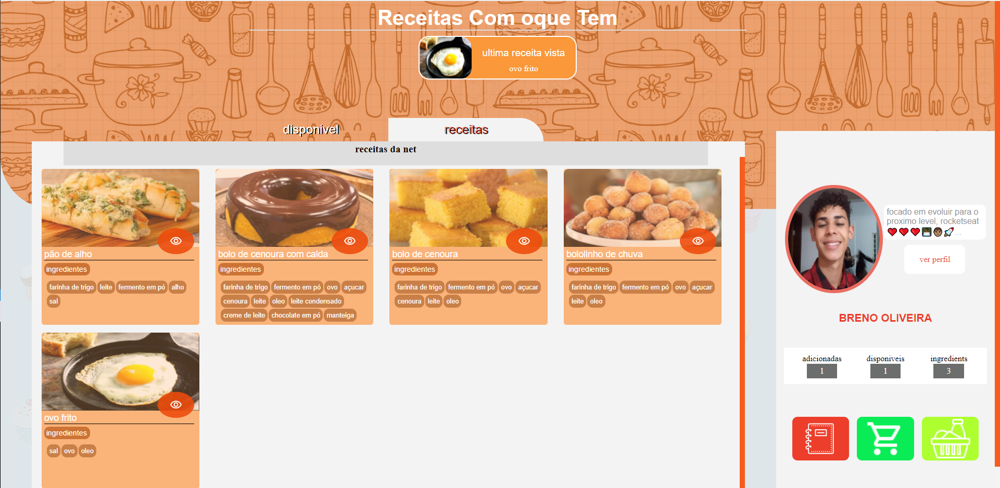
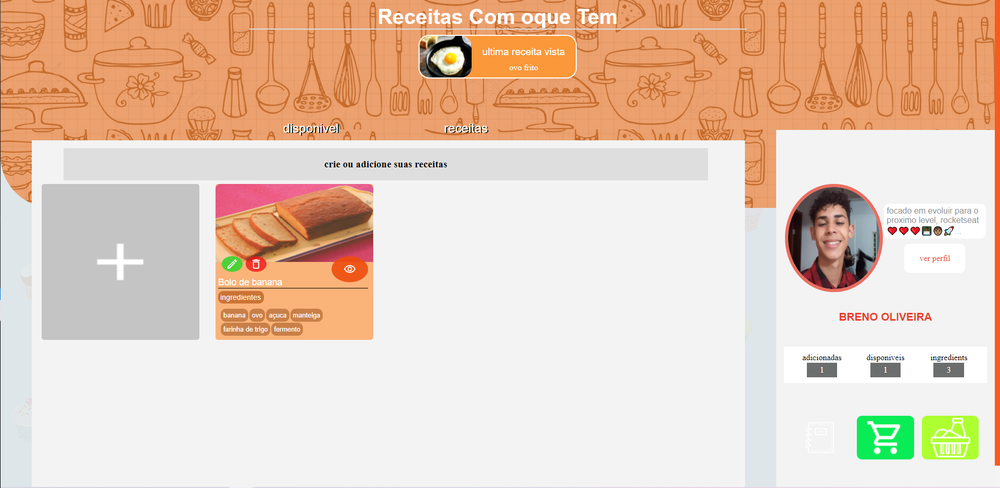
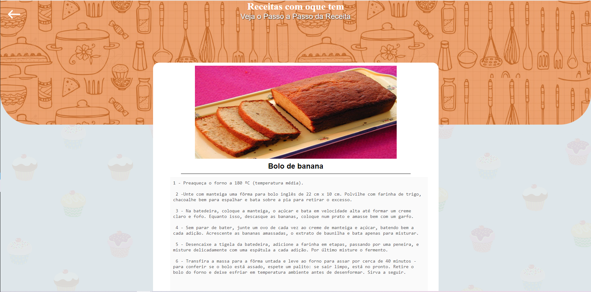
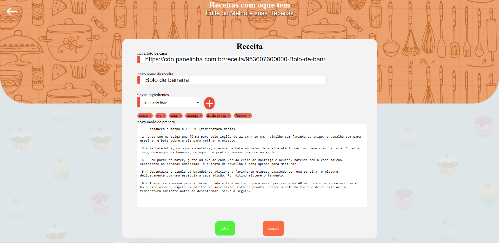
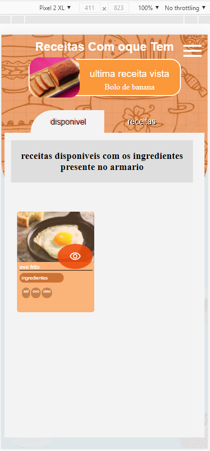
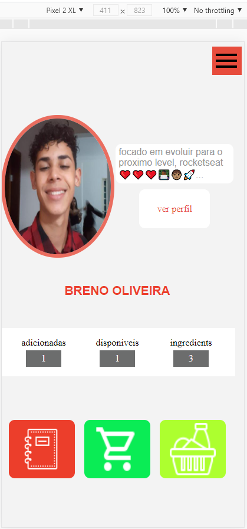
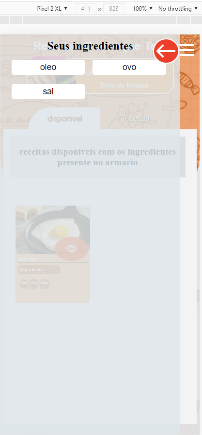

<h1 align="center">Receita Com oque tem
</h1>
## 🚀 Tecnologias

Esse projeto foi desenvolvido com as seguintes tecnologias:

- HTML
- CSS
- JavaScript
- NodeJS
- EJS
- Express
- SQLite
- Jquery

## 💻 Projeto

O Receitas pra quem tem é uma aplicação que te permite filtrar as receitas existentes em nossa aplicação e as receitas criadas por você a fim de lhe retornar receitas disponiveis com os ingredients presentes em sua casa, 🍎🍐🌭 🍔 🍟 🍕

## sobre

Esse projeto foi feito apartir do aprendizado da maratona discovery da rocketseat,e faz parte do meu projeto secundario da semana

## imagens do projeto

## imagens do projeto em display menores

    
    
    

